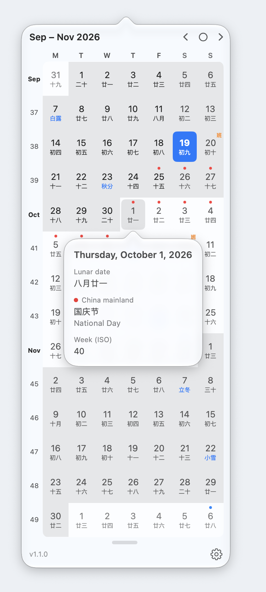
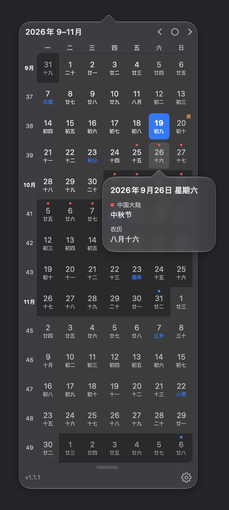

# Mini Calendar (mCalendar)

A minimal, keyboard-free macOS menu bar calendar. Click the date in your menu
bar to see one continuous grid spanning up to six months, with lunar dates and
public holidays if you want them.

<p align="center">
  
  &nbsp;&nbsp;
  
</p>

<p align="center"><sub>Lunar dates and holidays switched on; click any day for its details.<br>
开启农历和节假日后的样子;点击任意一天可查看详情。</sub></p>

## Why

I built Mini Calendar for one small, recurring moment: when I'm planning
something and just need to *see* a calendar — what weekday a date falls on,
how the next few weeks line up. Opening the full Calendar app for that always
felt like too much.

So this app does one thing: click the menu bar, and a calendar is in front of
you. No events, no reminders, no accounts — and there never will be. A calendar
you can glance at, instantly, that stays out of the way — that's the whole
product.

That is also the test for anything added. Lunar dates and public holidays
passed it: they answer the same glance — is that day a holiday? what is the
lunar date? — without asking you to enter or manage anything. Both are off
until you switch them on, so the plain calendar stays exactly as it was.
Features that turn it into something you have to maintain are not coming.

## 为什么做这个

做这个应用的初衷很简单:做计划的时候,我常常只是想**看一眼日历**——某天是星期几、
接下来几周怎么排。为了看个日期去打开完整的日历应用,总觉得太重了。

所以它只做一件事:点一下菜单栏,日历就在眼前。没有日程、没有提醒、不用登录
账号——将来也不会有。一个点开就能看到日历、看完就退开的小工具,这就是它的全部。

新功能也按这个标准取舍。农历和节假日符合它:它们回答的仍是"看一眼"的问题——
那天放不放假?农历是几号?——不需要你录入或维护任何东西。两者默认关闭,不打开的话,
日历和原来一模一样。会让它变成需要打理的东西的功能,不会加。

## Features

- **Menu bar label** shows the current date and weekday (each can be toggled
  off; falls back to a calendar icon)
- **Continuous multi-month view**: 1–6 months in a single scrolling-free grid,
  the current month bright, following months dimmed
- **Drag the grip** under the grid to open or close months on the spot (or set
  the count in Settings)
- **Week numbers** in the left gutter, with the month abbreviation marking the
  week each month starts (column can be hidden)
- **Lunar dates** (农历) under each day, with the **24 solar terms** in blue on
  the days they fall. Optional, and computed on your Mac
- **Public holidays** as a coloured dot above the day, one colour per country:
  China, Finland, Estonia, the US and Kazakhstan. China's make-up workdays
  (调休上班) are marked "班". Optional and off by default; it is the only
  feature that uses the network (see [Privacy](#privacy))
- **Click any day** for its details: full date, lunar date, solar term, each
  country's holiday names, make-up workday and ISO week number
- Day cells only grow when lunar dates or holidays are on, so the plain grid
  stays as compact as before
- **Today** highlighted, `‹ ◯ ›` to page months / jump back to today
- **Monday-first** weeks, weekends dimmed
- **Light / dark / system** appearance
- **English / 中文** interface (or follow the system language)
- Right-click the menu bar icon for About / Quit
- Settings live in a standalone window (gear button in the popover)

## 功能

- **菜单栏标签**显示当天日期和星期(可分别关闭;都关闭时显示日历图标)
- **连续多月视图**:1–6 个月排成一张无需滚动的网格,当月醒目,后面的月份淡一些
- **拖动日历下方的小横条**即可随手增减月份(也可在设置中调整)
- **周数列**显示在左侧,每月开始的那一周改为显示月份缩写(可隐藏)
- **农历**显示在每天下方,**二十四节气**当天以蓝字显示节气名。可选,全部在本机计算
- **节假日**以彩色圆点标在日期上方,每个国家一种颜色:中国、芬兰、爱沙尼亚、美国、
  哈萨克斯坦。中国的调休上班日标"班"。可选且默认关闭;这是唯一联网的功能
  (见[隐私](#privacy))
- **点击任意一天**查看详情:完整日期、农历、节气、各国节日名称(原名加翻译)、
  调休上班以及 ISO 周数
- 只有打开农历或节假日时日期格才会变大,不打开时日历和原来一样紧凑
- **今天**高亮显示,`‹ ◯ ›` 翻月 / 回到今天
- **周一**为一周的第一天,周末颜色较淡
- **浅色 / 深色 / 跟随系统**外观
- **English / 中文**界面(或跟随系统语言)
- 右键点击菜单栏图标可打开"关于"或退出
- 设置在独立窗口中(点弹窗里的齿轮按钮)

## Download

Grab `mCalendar-x.y.zip` from the
[Releases page](https://github.com/javaidea/mCalendar/releases), unzip,
and drag `mCalendar.app` into `/Applications`.

Builds from v1.0.1 on are signed with a Developer ID certificate and notarized
by Apple, so they open normally — no security warning, no right-click dance.
(中文:v1.0.1 起已通过 Apple 公证,下载后可直接打开。)

## Privacy

Mini Calendar collects nothing and sends nothing about you. The only network
access is downloading public holiday lists, and only after you turn holidays
on (they are off by default). Preferences are stored locally. See
[PRIVACY.md](PRIVACY.md) for exactly which hosts are contacted and how to
verify it yourself.

(中文:不收集任何信息;只有在你打开"显示节假日"后才会联网下载公开的节假日列表,
默认关闭。详见 [PRIVACY.md](PRIVACY.md)。)

## Requirements

- macOS 13+
- Xcode 15+ (Swift 5.9) to build

## Build & Run

Open `mCalendar.xcodeproj` in Xcode and hit **⌘R**.

Command line alternatives:

```sh
# Release app + distribution zip, output under build/
./scripts/release.sh

# Or via Xcode's build system directly
xcodebuild -project mCalendar.xcodeproj -scheme mCalendar -configuration Release build

# Or run the bare executable via SwiftPM (no app bundle)
swift run
```

The app is a menu-bar-only agent (`LSUIElement`): it shows no Dock icon and no
main window. To launch it at login, add the built app to
**System Settings → General → Login Items**.

## License

[MIT](LICENSE) © 2026 Zhou Yang
